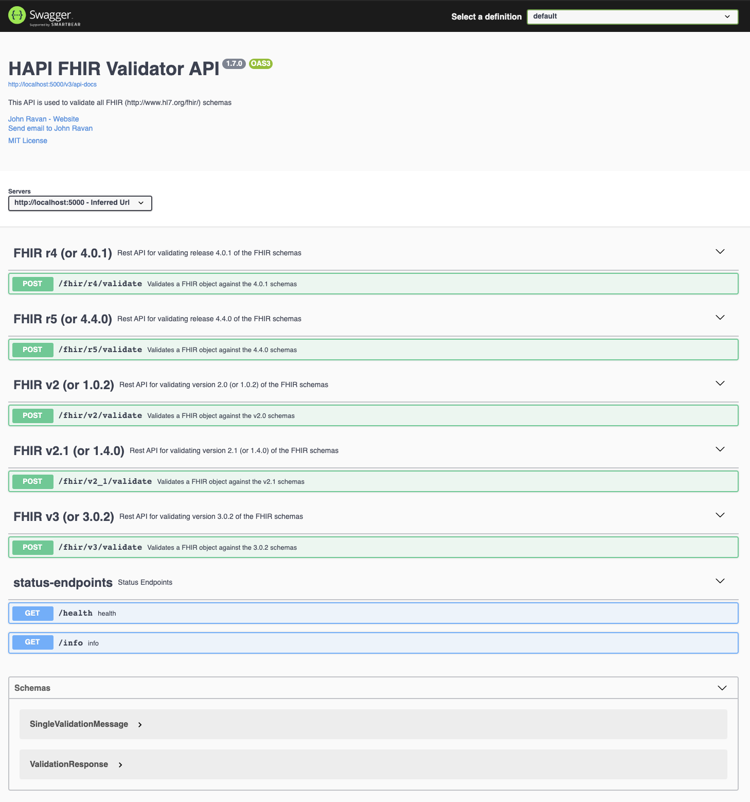
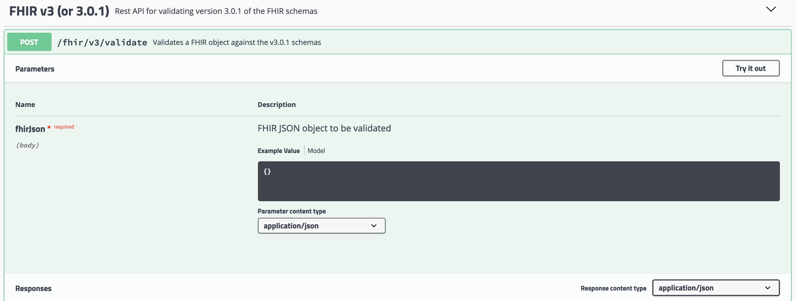

# HAPI FHIR Validator API


[](https://opensource.org/licenses/MIT)
[](http://makeapullrequest.com)

## What is the FHIR Validator API?

The HAPI FHIR Validator API is a simple REST API in order to validate the structure and content of a FHIR object. The API uses
the HAPI FHIR framework located at [https://hapifhir.io/](https://hapifhir.io/) in order to validate different all versions
of FHIR objects. [FHIR](https://www.hl7.org/fhir/overview.html) stands for Fast Healthcare Interoperability Resources which
is a standard for data transmission within healthcare.

## Structure of the API

See our [Swagger Hub API](https://app.swaggerhub.com/apis/jtravan/hapi-fhir-validator-api/1.7.0)

If you want to see the raw JSON visit [http://localhost:5000/v2/api-docs](http://localhost:5000/v2/api-docs)

## Get Started

Check out our [How To Validate FHIR Resources Guide](https://github.com/jtravan3/hapi-fhir-validator-api/blob/master/docs/how-to-validate-fhir-resources.md)

## Quickstart

```bash
docker run --name hapi-fhir-validator-api -p 5000:5000 jtravan3/hapi-fhir-validator-api:latest
```

Access the API by visiting [http://localhost:5000/swagger-ui/index.html](http://localhost:5000/swagger-ui/index.html). From there you can hit the endpoints directly.

## Developer Setup

### Environment Setup (Without Docker)

1.) Install maven 3.6.0 and Java JDK 11. JDK located [here](https://openjdk.java.net/install/) or use the Maven wrapper
that's a part of this repository.

```bash
brew install maven
```

2.) Clone down the repository from Github

```bash
git clone git@github.com:jtravan3/hapi-fhir-validator-api.git
```

3.) After populating the properties build the project

```bash
./mvnw clean install
```

4.) Run the api.

```bash
./mvnw spring-boot:run
```

The project is configured with Spring dev tools which allows for hot reloads without restarting the application. Simply
rebuild the project after making a change (In IntelliJ use `Build -> Build Project` or `CMD + F9`) and the application will
auto re-deploy.

5.) Access the API by visiting [http://localhost:5000/swagger-ui/index.html](http://localhost:5000/swagger-ui/index.html). From there you can hit the endpoints directly.

6.) Success!

## Docker Setup

1.) Install Docker located [here](https://docs.docker.com/docker-for-mac/install/).

2.) Clone down the repository from Github

```bash
git clone git@github.com:jtravan3/hapi-fhir-validator-api.git
```

3.) Run the API

```bash
docker-compose up
```

4.) Access the API by visiting [http://localhost:5000/swagger-ui/index.html](http://localhost:5000/swagger-ui/index.html). From there you can hit the endpoints directly.

5.) Success!

## Using Swagger

1.) Access the API at [http://localhost:5000/swagger-ui/index.html](http://localhost:5000/swagger-ui/index.html). You should see the following homepage.



2.) Once on the API, select the validation endpoint that you want to try out.



3.) Replace the `{}` with the FHIR JSON object that you want to validate


4.) Click *Execute* and then scroll down to see the response. If the response is successful you should see a JSON response of success

```json
{
  "successful": true,
  "errors": [],
  "warnings": [],
  "info": [],
  "exception": null
}
```

If there are issues the messages will be associated with their designated severity level.

```json
{
  "successful": false,
  "errors": [
    {
      "message": "Unrecognised property '@nae'",
      "locationString": "/Parameters/parameter",
      "severity": "ERROR",
      "locationLine": null,
      "locationCol": null
    },
    {
      "message": "Unrecognised property '@valeString'",
      "locationString": "/Parameters/parameter/part",
      "severity": "ERROR",
      "locationLine": null,
      "locationCol": null
    },
    {
      "message": "Profile http://hl7.org/fhir/StructureDefinition/Parameters, Element 'Parameters.parameter[1].name': minimum required = 1, but only found 0",
      "locationString": "Parameters.parameter[1]",
      "severity": "ERROR",
      "locationLine": null,
      "locationCol": null
    },
    {
      "message": "cvc-complex-type.2.4.a: Invalid content was found starting with element '{\"http://hl7.org/fhir\":valueBoolean}'. One of '{\"http://hl7.org/fhir\":extension, \"http://hl7.org/fhir\":modifierExtension, \"http://hl7.org/fhir\":name}' is expected.",
      "locationString": null,
      "severity": "ERROR",
      "locationLine": 1,
      "locationCol": 79
    }
  ],
  "warnings": [],
  "info": [],
  "exception": null
}
```

## Relaxing Validation

If you want to relax the validation you can pass the header `X-Validate-Ignore-Codesystem` with a value of `true` to ignore
certain code systems and profiles. This will allow you to only validate the structure of the FHIR resources rather than focusing
on the systems included. This is helpful if you can't control the source of the data that you are validating.

## Contributing
Please see [CONTRIBUTING.md](https://github.com/jtravan3/hapi-fhir-validator-api/blob/master/CONTRIBUTING.md) for more details regarding contributing issues or code.

## Questions
If you are experiencing a bug, please feel free to file an issue. For general questions, please post them to [StackOverflow](https://stackoverflow.com/search?q=hapi-fhir-validator-api) with the tag `hapi-fhir-validator-api`.

## License
The content of this project itself is licensed under the [Creative Commons Attribution 3.0 Unported](https://creativecommons.org/licenses/by/3.0/) license, and the underlying source code used to format and display that content is licensed under the [MIT license](https://github.com/jtravan3/hapi-fhir-validator-api/blob/master/LICENSE.md).

## Resources

### Spring Boot

For further references with Spring Boot:

- [Spring Initializr](https://start.spring.io/)
- [Getting Started](https://spring.io/guides/gs/spring-boot/)

### Maven

For further references with Maven's dependency management framework:

- [Spring and Maven](https://spring.io/guides/gs/spring-boot/)
- [Official Apache Maven documentation](https://maven.apache.org/guides/index.html)
- [Apache Maven Getting Started](https://maven.apache.org/guides/getting-started/)

